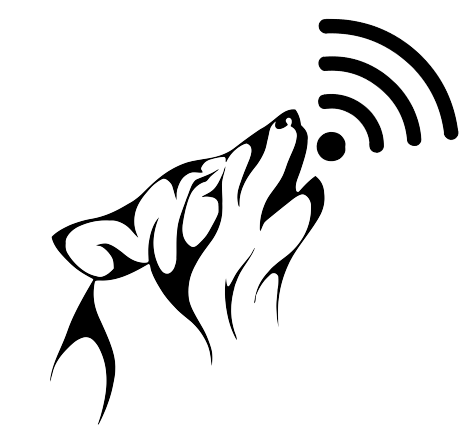

# **Winfi** - versión 1.0

    

**Winfi** es una herramienta que sirve para el despliegue de varios ataques a redes wireless.

## Ataques disponibles:

* **Obtención de Handshake**
    
* **Beacon Flood**
    
**Requisitos:** Contar con una tarjeta de red que acepte **modo minitor**

